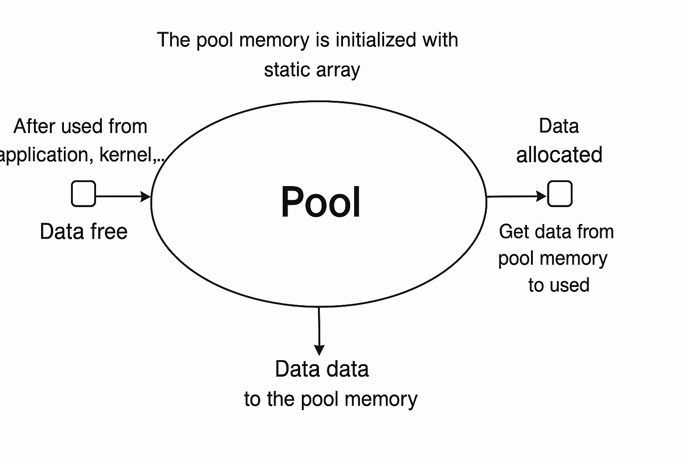
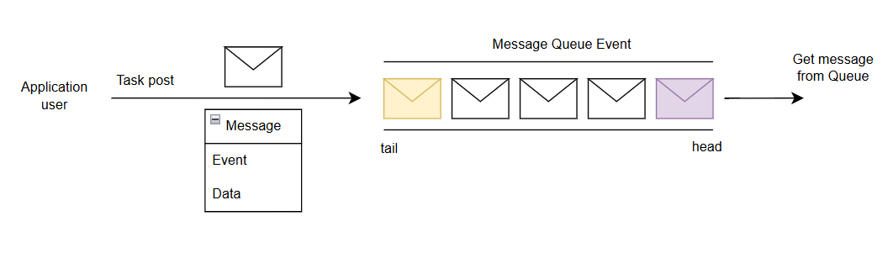

# LSTK - The LOC Simple Task Kernel

**LSTK (LOC Simple Task Kernel)** is an event-driven kernel designed to manage tasks efficiently using the **Active Object** model and **priority-based preemption**. Each task maintains its own message queue, and messages are posted and handled asynchronously. Once a task receives and processes a message, it is automatically removed from the queue by the kernel.

### Key Concepts:
- Active Object and priority preemption  
- Per-task message queues  
- Automatic message handling and removal  
- Event-driven architecture  

To fully understand this model, learners should have basic knowledge of data structures such as linked lists, queues, memory pools, and object-oriented programming (OOP).

### Features:
- Memory pool management  
- Message posting and handling mechanisms  
- Timer list support  
- Observer pattern for decoupled communication  

## 1. Memory Pool:
<!-- Add your description for memory pool here -->
Efficient memory management is essential in embedded programming. Proper control of memory usage enhances system performance and helps reduce costs when selecting a microcontroller.

In this kernel, memory is managed using a memory pool. A fixed block of memory is allocated during initialization to create the pool.

When memory is needed, the kernel automatically takes a block from the pool. After the task is completed, the kernel also automatically frees the memory and returns it to the pool for reuse.

```c
/* Allocate memory */
void * mem_pool_allocate(void)

/* Free memory */
void mem_pool_free(void * ptr);

/* Dump block */
uint32_t mem_pool_getFreeBlockCount();
```

## 1. Task post:
When the task post function is called, the kernel adds the message content to the task’s queue.

```c
/* Post Event, Data to task's queue */
void LTK_Task_post(LTK_Task_t * const me, LTK_Evt_t const * const e);
```
The content of a message includes:
- Event.
- Data — if you want to post data along with the event, you need to use a mutable event or allocate memory from the pool before posting.

## 3. Timer
Because this kernel uses an event-driven model, blocking delays cannot be used. Therefore, a non-blocking timer is designed to provide timing functionality without stopping task execution.
This timer is triggered by the system tick and, on each tick, the handler checks the timer list, processes timer messages (type, period, task ID, etc.), and posts events to the corresponding tasks periodically.
```c
/* Set timer */
void LTK_TimeEvt_arm(struct LTK_TimeEvt_t * me, uint32_t ctr, uint32_t interval);

/* deleted timer */
bool LTK_TimeEvt_disarm(struct LTK_TimeEvt_t * me);
```
When calling the timer set function, the kernel sends messages similar to task posting according to the configured timing cycle. There are two types of timers:

- For a **one-shot timer**, set `interval` to `0` so the timer triggers only once after `ctr` ticks.  
- For a **periodic timer**, set `interval` equal to `ctr` so the timer triggers repeatedly every `interval` ticks.

When calling the remove timer function, the kernel will proceed to delete the message to be deleted from the timer list.
